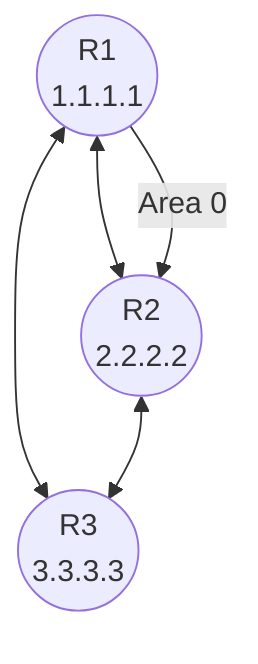
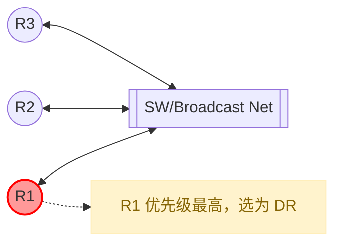

# AI Day 02：学会用 Mermaid 画网络拓扑图


---

### 第一步：让你的网站支持 Mermaid

我们需要在 VS Code 终端里安装一个 VitePress 的 Mermaid 插件。请确保你的项目还在运行（如果没运行，先运行 `npm install`），然后在终端输入：

PowerShell

```
npm add -D vitepress-plugin-mermaid mermaid
```

*（这行命令是告诉 npm：请帮我下载画图用的插件和核心代码，只在开发时使用。）*

------

### 第二步：修改“大脑”配置文件

还记得那个 `.vitepress/config.mjs` 吗？我们需要通知它一声：现在要启用画图功能了。

打开 `.vitepress/config.mjs`，**全选并替换**为下面的内容（我帮你整合了昨天的侧边栏配置）：

JavaScript

```
import { defineConfig } from 'vitepress'
import { withMermaid } from 'vitepress-plugin-mermaid' // 1. 引入画图插件

// 2. 用 withMermaid 包裹原来的配置
export default withMermaid(defineConfig({
  title: "AI & 网络实验室",
  description: "电信人从菜鸟到专家的 AI 进化记录",
  
  themeConfig: {
    siteTitle: 'AI & 网络实验室',
    search: {
      provider: 'local'
    },
    nav: [
      { text: '首页', link: '/' },
      { text: 'IP技术', link: '/ospf-day01' },
      { text: 'AI历程', link: '/ai-day01' }
    ],
    // 侧边栏配置（整合了前两天内容）
    sidebar: [
      {
        text: '🤖 AI 学习历程',
        items: [
          { text: 'Day 01: 环境搭建与避坑', link: '/ai-day01' }
        ]
      },
      {
        text: '🌐 IP 网络技术 30 天',
        collapsed: false,
        items: [
          { text: 'Day 01: OSPF 状态机原理', link: '/ospf-day01' },
          { text: 'Day 02: 状态机故障复现', link: '/ospf-day02' },
          { text: 'Day 03: LSA 深度解剖', link: '/ospf-day03' } // 今天新增
        ]
      }
    ]
  }
}))
```

**保存文件后，强烈建议重启开发服务器：** 在终端按 `Ctrl + C`，然后输入 `npm run dev`。

------

### 第三步：开始画图（实战 OSPF 拓扑）

现在，你可以在新建的 **`ospf-day03.md`** 里，像写代码一样写拓扑图了。

Mermaid 的语法非常直观：`A --> B` 就是 A 指向 B。

在 Markdown 里，使用 **```mermaid** 开头的代码块即可：

### 示例1：极简 OSPF 三角形拓扑




### 示例2：进阶——展示 DR 选举过程



